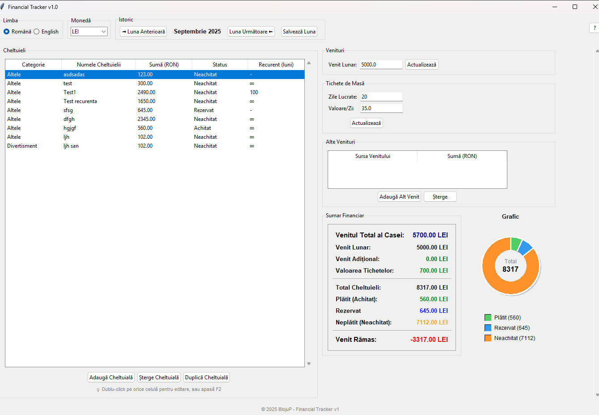

# Financial Tracker v1.0

O aplicație pentru gestiunea finanțelor personale dezvoltată în Python cu interfață grafică Tkinter. Permite urmărirea cheltuielilor, veniturilor și planificarea bugetului lunar.

Română | [English](README.md)

## Caracteristici Principale

- 📊 Gestionarea cheltuielilor cu categorii multiple
- 💰 Urmărirea veniturilor și tichetelor de masă
- 🔄 Cheltuieli recurente (fixe, cu durată limitată sau indefinite)
- 💳 Suport pentru credite cu asigurare și plăți în avans
- 🏠 Sumar financiar cu grafice interactive
- 🌐 Suport multilingv (Română/Engleză)
- 🗓️ Navigare între luni cu salvare automată
- 💾 Salvare automată în format JSON

## Capturi de Ecran

### Interfata principala


### Adauga cheltuieli


### Adauga venit suplimentar


## Cerințe de Sistem

- Python 3.8 sau mai nou
- Sistema de operare: Windows, macOS, Linux
- RAM minim: 512 MB
- Spațiu pe disc: 50 MB

## Dependințe

Aplicația folosește doar librării standard Python:

- `tkinter` - Interfața grafică (inclusă în Python)
- `json` - Pentru salvarea datelor
- `datetime` - Pentru gestiunea datelor
- `pathlib` - Pentru managementul fișierelor
- `typing` - Pentru type hints

## Instalare

### Pasul 1: Instalează Python

Descarcă și instalează Python de la [python.org](https://python.org):
- Windows: Descarcă executabilul și urmează instrucțiunile
- macOS: Folosește Homebrew: `brew install python`
- Linux: `sudo apt-get install python3 python3-tkinter`

### Pasul 2: Descarcă Aplicația

```bash
# Clonează repository-ul
git clone https://github.com/BlojuP/Financial_app.git
cd financial-tracker

# SAU descarcă ZIP-ul și extrage
wget https://github.com/BlojuP/Financial_app/archive/main.zip
unzip main.zip
cd financial-tracker-main
```

### Pasul 3: Rulează Aplicația

```bash
# Execută direct
python financial_tracker v1.py

# SAU pe Linux/macOS
python3 financial_tracker v1.py
```

## Utilizare

### Pornirea Aplicației

Aplicația se va deschide cu interfața principală care conține:

- **Panoul stâng**: Lista cheltuielilor cu categorii, sume și status
- **Panoul drept**: Venituri, tichete de masă, alte venituri și sumar financiar

### Gestionarea Cheltuielilor

#### Adăugarea unei Cheltuieli

1. Click pe "Adaugă Cheltuială"
2. Completează numele cheltuielii
3. Alege tipul:
   - **Cheltuială Normală**: Pentru cheltuieli obișnuite
   - **Credit cu Asigurare/Avans**: Pentru credite cu costuri suplimentare

#### Categorii Disponibile

- **Facturi**: Utilități, telefon, internet
- **Transport**: Carburant, transport public, întreținere auto
- **Mâncare**: Cumpărături, restaurante
- **Sănătate**: Medicamente, consultații medicale
- **Divertisment**: Cinema, cărți, hobby-uri
- **Îmbrăcăminte**: Haine, încălțăminte
- **Educație**: Cursuri, cărți, materiale
- **Altele**: Cheltuieli diverse

#### Tipuri de Credit

Pentru creditele cu asigurare/avans:
- **Ipotecar**: Credite imobiliare
- **Nevoi Personale**: Credite de consum
- **Overdraft**: Descoperire de cont
- **Card de Credit**: Plăți cu cardul

#### Cheltuieli Recurente

- **Recurențe Fixe**: Specifică numărul exact de luni
- **Recurențe Indefinite**: Lasă câmpul gol pentru recurență continuă
- **Credite**: Se adaugă automat pentru numărul de luni rămas

#### Statusuri Cheltuieli

- **Achitat**: Cheltuiala a fost plătită
- **Neachitat**: Cheltuiala nu a fost încă plătită
- **Rezervat**: Bani rezervați pentru această cheltuială

### Gestionarea Veniturilor

#### Venit Lunar

- Setează venitul fix lunar în câmpul dedicat
- Click "Actualizează" pentru a salva

#### Tichete de Masă

- **Zile Lucrate**: Numărul de zile lucrate în lună
- **Valoare/Zi**: Valoarea unui tichet de masă
- Total calculat automat

#### Alte Venituri

- Adaugă venituri suplimentare (freelancing, bonusuri, etc.)
- Specifică sursa și suma

### Navigarea între Luni

- Folosește săgețile "◄ Luna Anterioară" și "Luna Următoare ►"
- Datele se salvează automat la navigare
- Click "Salvează Luna" pentru salvare manuală

### Sumar Financiar

Panoul de sumar afișează:

- **Venitul Total al Casei**: Suma tuturor veniturilor
- **Venit Lunar**: Salariul de bază
- **Venit Adițional**: Alte surse de venit
- **Valoarea Tichetelor**: Total tichete de masă
- **Total Cheltuieli**: Suma tuturor cheltuielilor
- **Plătit/Neachitat/Rezervat**: Breakdown-ul cheltuielilor
- **Venit Rămas**: Diferența între venituri și cheltuieli

### Graficul Circular

- Vizualizează proporția cheltuielilor plătite, neplătite și rezervate
- Culori intuitive: Verde (plătit), Portocaliu (neachitat), Albastru (rezervat)
- Legendă interactivă cu valori exacte

## Funcționalități Avansate

### Editare Rapidă

- **Dublu-click** pe orice element din listă pentru editare
- **F2** pentru editare rapidă
- Modificările se salvează automat

### Duplicarea Cheltuielilor

- Selectează o cheltuială și click "Duplică Cheltuială"
- Utile pentru cheltuieli similare recurente

### Căutare și Filtrare

- Cheltuielile sunt organizate pe categorii
- Statusurile sunt afișate vizual cu culori

### Backup și Restaurare

Datele sunt salvate în `~/financial_data.json`:

```bash
# Backup manual
cp ~/financial_data.json ~/financial_backup_$(date +%Y%m%d).json

# Restaurare
cp ~/financial_backup_20250101.json ~/financial_data.json
```

## Structura Datelor

Datele sunt organizate pe luni în format JSON:

```json
{
  "monthly_data": {
    "2025_01": {
      "income": {"monthly_income": 2000.0},
      "expenses": [
        {
          "name": "Electricitate",
          "type": "Normal",
          "category": "bills",
          "base_amount": 150.0,
          "total_amount": 150.0,
          "status": "Neachitat"
        }
      ],
      "meal_tickets": {
        "worked_days": 20,
        "value_per_day": 35.0
      },
      "other_income": []
    }
  }
}
```

## Rezolvarea Problemelor

### Aplicația nu pornește

```bash
# Verifică versiunea Python
python --version

# Verifică dacă tkinter este instalat
python -c "import tkinter; print('Tkinter OK')"

# Pe Linux, instalează tkinter separat
sudo apt-get install python3-tkinter
```

### Eroare de permisiuni la salvare

- Aplicația încearcă să salveze în directorul home
- În caz de problemă, va salva în directorul curent
- Verifică permisiunile pentru `~/financial_data.json`

### Date corupte

```bash
# Șterge fișierul de date pentru resetare completă
rm ~/financial_data.json

# Aplicația va crea un nou fișier la următoarea pornire
```

## Contribuții

1. Fork repository-ul
2. Creează un branch pentru feature: `git checkout -b feature-name`
3. Commit modificările: `git commit -m "Adaugă feature nou"`
4. Push la branch: `git push origin feature-name`
5. Creează un Pull Request

### Ghid pentru Dezvoltatori

```python
# Structura principală
class FinancialTrackerGUI:  # Interfața principală
class ExpenseDialog:        # Dialog pentru cheltuieli
class OtherIncomeDialog:    # Dialog pentru alte venituri

# Fișiere importante
financial_tracker_gui.py   # Aplicația principală
README.md                 # Documentația în engleză
README.ro.md              # Această documentație
```

## Licență

© 2025 BlojuP - Toate drepturile rezervate.

Pentru suport: blojup@pentrucasata.ro

## Roadmap

- [ ] Export în Excel/CSV
- [ ] Rapoarte lunare/anuale
- [ ] Categorii personalizate
- [ ] Sincronizare cloud
- [ ] Aplicație mobile
- [ ] Import din banca
- [ ] Notificări pentru facturi
- [ ] Grafice de tendințe

---

**Versiunea curentă**: 1.0  
**Ultima actualizare**: Septembrie 2025  
**Compatibilitate**: Python 3.8+